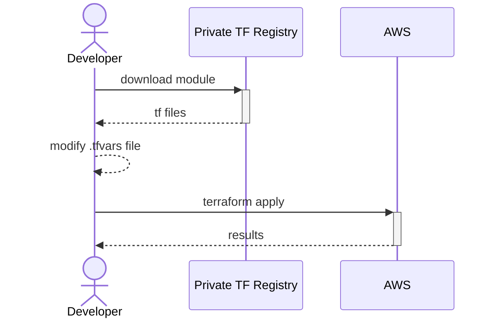

# Instructions

1. Run `terraform init` to install all modules required by this configuration.
2. Run `terraform plan -var-file="env/development.tfvars"` to output the execution plan.
3. Run `terraform apply -var-file="env/development.tfvars` to create S3 bucket.

# Quick Sketch

I'm going to assume Terraform modules are published to a private Terraform Registry, similar to how NPM javascript packages are published.

