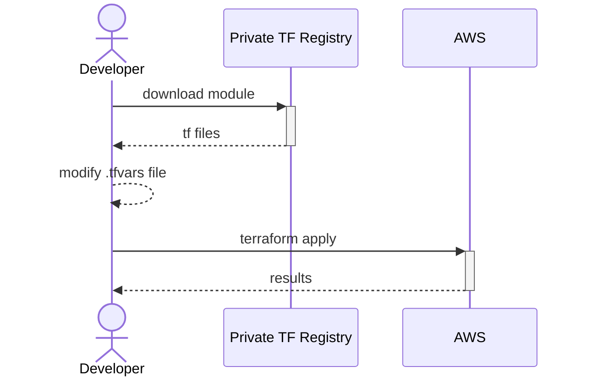
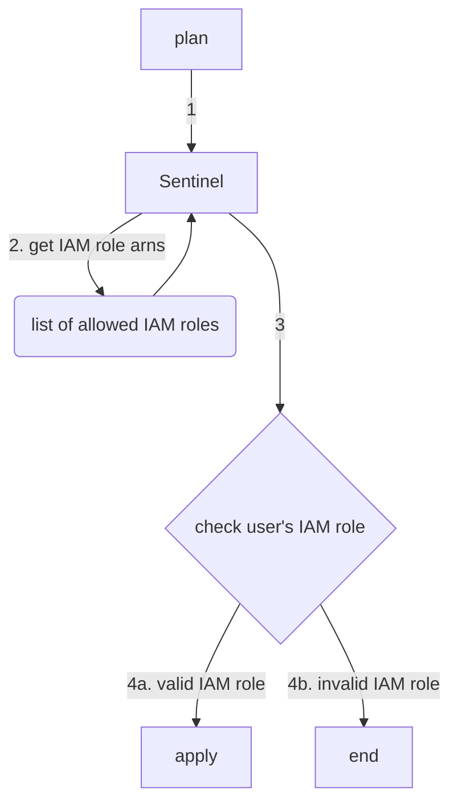

# Instructions

1. Run `terraform init` to install all modules required by this configuration.
2. Run `terraform plan -var-file="env/development.tfvars"` to output the execution plan.
3. Run `terraform apply -var-file="env/development.tfvars` to create S3 bucket.

# Quick Sketch

I'm going to assume Terraform modules are published to a private Terraform Registry, similar to how NPM javascript packages are published.

# Bonus

I'm by no means an expert in Terraform, but my initial research points me to the implementation of [Sentinel Policies](https://developer.hashicorp.com/terraform/cloud-docs/policy-enforcement/sentinel).
Also found some [Sentinel Policies for AWS](https://github.com/hashicorp/terraform-guides/tree/master/governance/first-generation/aws)

My guess is that running Terraform will look like this:

